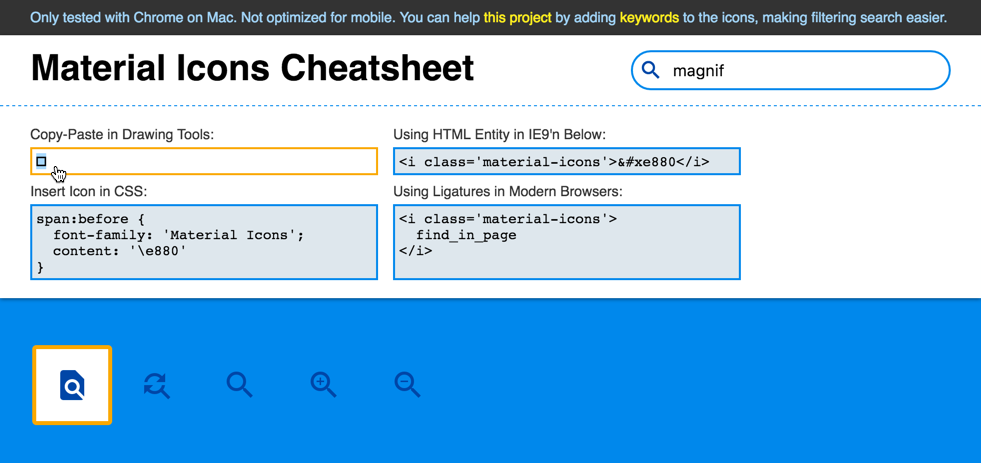

# Material Icons Cheatsheet
## Making Copy-Paste Easy

I created this cheatsheet so that I can easily copy paste the icons in drawing programs such as Sketch, Photoshop, Illustrator... etc.

Also, in the original [Material Icon](https://design.google.com/icons/) Search, I could only search by icon name. So if I didn't know the magnifier icon was named as "search", and I typed in "magnifier", it wouldn't return anything.  

To improve the filtering, I tagged the icons with keywords, so that you don't have to remember the exact name to find the icon you want.



The icon-to-code mapping is pulled directly from [Google's Material Icon repo](https://github.com/google/material-design-icons/blob/master/iconfont/codepoints), so it should always be up to date whenever the original repo is updated.

The [keywords](https://github.com/Shanfan/material-icons-cheatsheet/blob/master/keywords) were added by myself. You can help this project by adding descriptive keywords to the icons. The icon name needs to match exactly to the original name. Then you add keywords after a blank space, separating multiple keywords by comma, without any space in between. For example:
```
ac_unit snow,winter,cold
access_alarm clock,time
access_alarms clock,time
access_time clock
accessibility persona
accessible disability
account_balance bank,federal,institution
```

## [Use the cheatsheet here.](https://shanfan.github.io/material-icons-cheatsheet/)

To use the icon font in a drawing tool like Photoshop, you need to install the font in your Font Book first. Once you pasted the icon, you can treat it as other text content, just set the font to be "Material Icons".

<!-- The [icon font from Google's repo](https://github.com/google/material-design-icons/tree/master/iconfont) doesn't seem to be compatible with Mac's Font Book. I downloaded the icon font from somewhere else. -->
